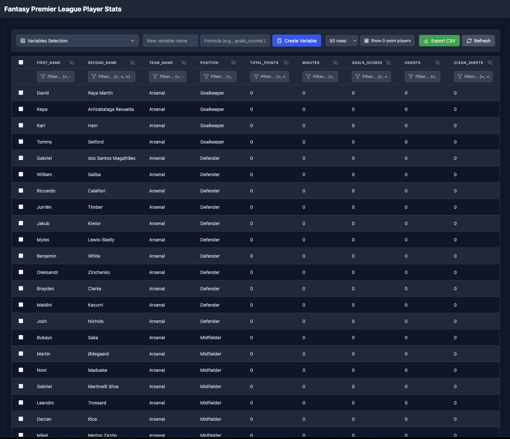

# Fantasy Premier League Stats Dashboard



## Overview

This project is a Fantasy Premier League (FPL) Stats Dashboard built with React. It provides an interactive and customizable interface for viewing and analyzing player statistics from the Fantasy Premier League.

## Features

- **Data Fetching**: Retrieves real-time data from the official FPL API.
- **Interactive Table**: Displays player statistics in a dynamic, sortable, and filterable table.
- **Custom Columns**: Allows users to create custom columns using mathematical formulas based on existing data.
- **Column Management**: Users can show/hide columns and reorder them as needed.
- **Filtering**: Supports complex filtering options, including greater than, less than, and equal to operations.
- **Row Selection**: Select multiple players with checkboxes for comparison or export.
- **Pagination**: Navigate through data with configurable page sizes.
- **Keyboard Shortcuts**: Quick actions with Ctrl+A (select all), Ctrl+E (export), Ctrl+R (refresh).
- **CSV Export**: Export filtered data or selected players to CSV files.
- **Responsive Design**: Adapts to different screen sizes with resizable columns and a horizontal scroll for smaller devices.

## Technologies Used

- React
- Axios for API requests
- Tailwind CSS for styling
- Lucide React
- Flask app backend

## Setup and Installation

1. Clone the repository:
   ```
   git clone https://github.com/viktoragren/fpl-stats-dashboard.git
   ```

2. Navigate to the project directory:
   ```
   cd fpl-stats-dashboard
   ```

3. Install dependencies:
   ```
   npm install
   ```

4. Start the development server:
   ```
   npm start
   ```

5. Open [http://localhost:3000](http://localhost:3000) to view it in the browser.

## Usage

- **Sorting**: Click on column headers to sort the data.
- **Filtering**: Use the input fields below column headers to filter data. You can use >, <, and = for numeric comparisons.
- **Show/Hide Columns**: Click the "Variables Selection" dropdown to select which columns to display.
- **Create Custom Column**: Enter a column name and a formula (e.g., `goals_scored * 4`) to create a new column.
- **Resize Columns**: Drag the edge of a column header to resize it.
- **Row Selection**: Click checkboxes to select players, or use Ctrl+A to select all visible players.
- **Export Data**: Use the Export button or Ctrl+E to download data as CSV. Selected players will be exported if any are selected.
- **Pagination**: Use page size dropdown and navigation buttons to browse through data.

## API

This project uses a local API server to proxy requests to the official FPL API. Make sure the server is running (typically on port 300) before starting the React app.

